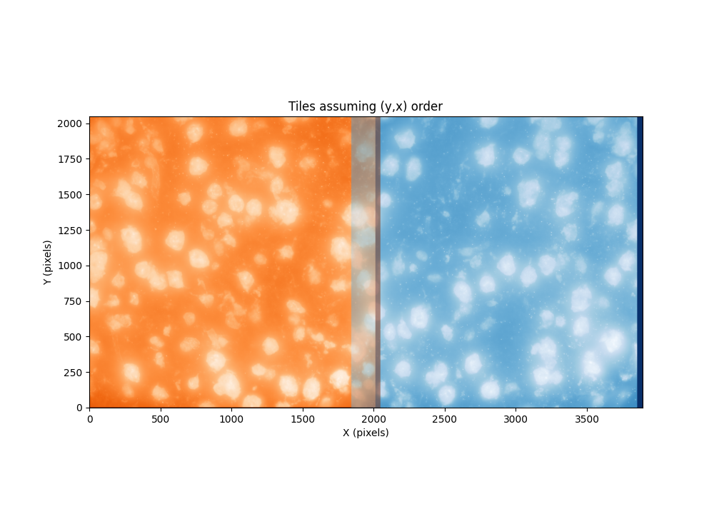
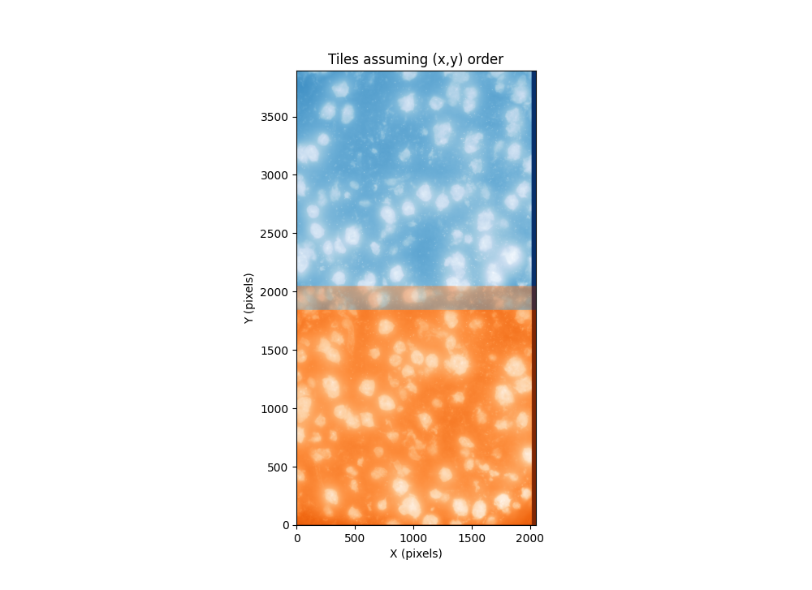
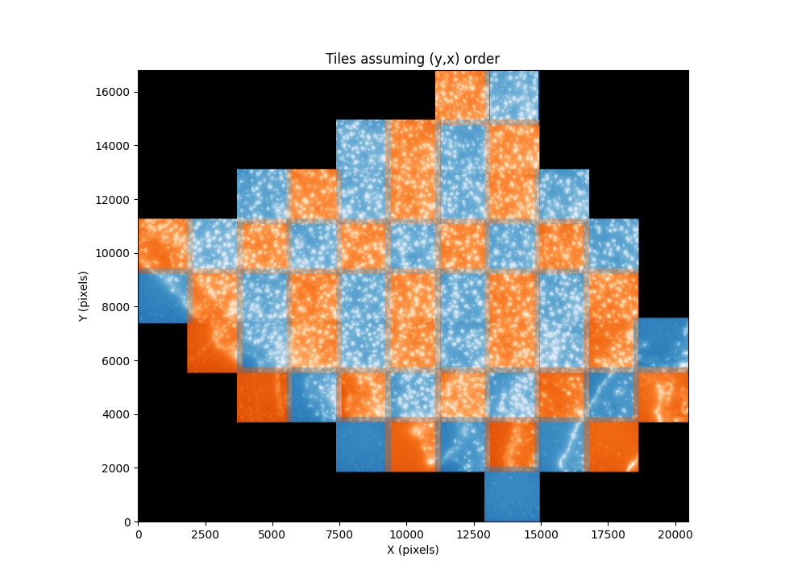
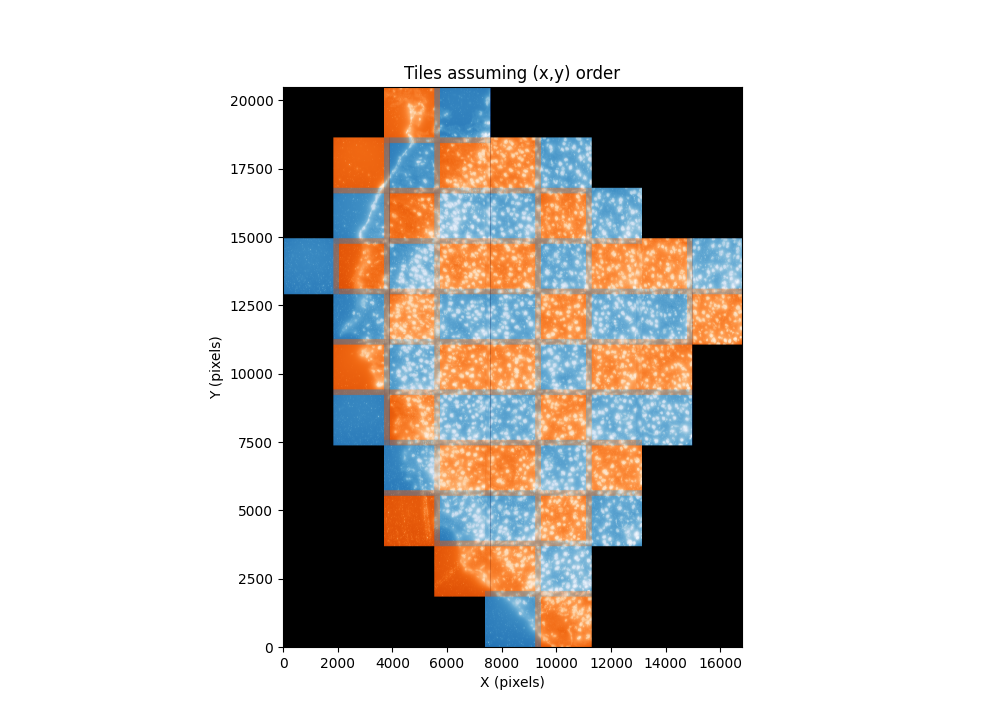

# Zhuang laboratory mouse motor cortex example

## Overview

This example reprocesses an existing 2D MERFISH dataset generated by the
[Zhuang laboratory](https://zhuang.harvard.edu/). The nearly raw data were
deposited in the Brain Image Library (BIL), which makes this a useful example
of adapting `merfish3d-analysis` to data from a different microscope and
acquisition package.

The sample used here, `mouse1_sample1_raw`, is a 22-bit MERFISH experiment.
Its image rounds were already aligned and warped within each field of view, but
the data still need conversion into a qi2lab datastore, global registration,
segmentation, decoding, filtering, and cell assignment.

## Requirements

The source dataset is approximately 760 GB. Allow roughly another 700 GB for
the qi2lab datastore and intermediate processing products. The original timing
estimates below came from a 12-core/24-thread workstation with 128 GB RAM, an
NVIDIA RTX 3090 24 GB GPU, and spinning-disk storage.

Clone the repository and create its `uv` environment:

```bash
git clone https://github.com/QI2lab/merfish3d-analysis
cd merfish3d-analysis
uv sync --group dev
```

Download the `additional_files`, `mouse1_sample1_raw`, and processed transcript
outputs for `mouse1_sample1` from the
[BIL dataset](https://download.brainimagelibrary.org/cf/1c/cf1c1a431ef8d021/).
The example scripts expect this layout beneath a top-level data directory:

```text
zhuang-data/
└── mop/
    └── mouse_sample1_raw/
        ├── additional_files/
        │   ├── codebook.csv
        │   ├── data_organization_raw.csv
        │   ├── microscope.json
        │   └── fov_positions/
        │       └── mouse1_sample1.txt
        ├── mouse1_sample1_raw/
        │   ├── aligned_images0.tif
        │   ├── aligned_images1.tif
        │   └── ...
        └── zhuang_decoded_codewords/
            └── spots_mouse1sample1.csv
```

The scripts accept paths as command-line inputs. They do not contain
machine-specific data paths.

## Determine image and stage orientation

Microscope acquisition packages differ in their camera-axis and stage-axis
conventions. A positive displacement in global stage coordinates must
correspond to the same positive displacement in image coordinates before tiles
can be placed correctly.

This BIL dataset contains six separated mouse-brain sections. Discontinuous
jumps in `additional_files/fov_positions/mouse1_sample1.txt` identify the
boundaries between sections. For example:

```text
58 2404.87, 1766.11
59 2204.87, 1366.11
60 -309.64, 2741.84
61 -309.64, 2541.84
```

Tiles 1 through 59 therefore form the first continuous tissue section.

Start by rendering two tiles under both possible interpretations of the stage
coordinate columns:

```bash
uv run python examples/zhuang_lab/00a_test_image_orientation.py \
  /path/to/zhuang-data \
  --n-tiles 2
```

| Stage columns interpreted as YX | Stage columns interpreted as XY |
| --- | --- |
|  |  |

The overlap shows that the XY interpretation is correct. Confirm it across the
entire first section:

```bash
uv run python examples/zhuang_lab/00a_test_image_orientation.py \
  /path/to/zhuang-data \
  --n-tiles 59
```

| Stage columns interpreted as YX | Stage columns interpreted as XY |
| --- | --- |
|  |  |

The 59-tile view confirms that the stage file is in XY order while NumPy image
arrays use YX indexing. The conversion accounts for this by exchanging the
last two image axes:

```python
flipped_image = np.swapaxes(raw_image, axes=(-2, -1))
```

The equivalent operation on stage positions would be:

```python
stage_positions_um = np.swapaxes(stage_positions_um, axes=(-2, -1))
```

Only one of these transformations should be applied.

## Understand the acquisition parameters

Several required microscope parameters are not encoded directly in the image
files. The conversion script records where values came from, including the
associated publication,
[Spatially resolved cell atlas of the mouse primary motor cortex by MERFISH](https://www.nature.com/articles/s41586-021-03705-x),
and camera documentation.

The important conversion settings are:

| Parameter | Value | Purpose |
| --- | --- | --- |
| Voxel spacing ZYX | `[1.5, 0.108, 0.108]` µm | Physical scaling and sampling-aware processing |
| Numerical aperture | `1.45` | PSF generation |
| Refractive index | `1.51` | PSF generation |
| Camera conversion | `0.46` electrons/ADU | Convert camera counts to electrons |
| Camera offset | `100` ADU | Remove the camera baseline |
| Tile overlap | `0.2` | Initialize global tile placement |
| Microscope type | `2D` | Select plane-wise processing defaults |

The 1.5 µm axial spacing is about five times the approximately 0.315 µm axial
Nyquist step for this optical configuration. Treating neighboring planes as a
well-sampled 3D volume would therefore be misleading. **Use 2D processing for
deconvolution, segmentation, normalization, decoding, and chromatic estimation.**
Keep `microscope_type="2D"`
and explicitly use `decode_mode="2d"` (`--decode-mode 2d` with the CLI).
The 1.5 µm Z spacing must still be retained for physical coordinates. Global
tile registration uses the full Z stack to estimate axial offsets, with no
binning in Z, as described below.

The conversion also constructs channel-specific PSFs from the emission
wavelengths, NA, refractive index, and lateral pixel size. The BIL files do not
provide a flatfield, so the example uses unity shading maps rather than
claiming an estimated illumination correction.

## Convert to a qi2lab datastore

Pass the directory containing `additional_files` and the nested raw-image
directory:

```bash
uv run python examples/zhuang_lab/01_convert_to_qi2lab.py \
  /path/to/zhuang-data/mop/mouse_sample1_raw
```

By default, this writes `/path/to/zhuang-data/qi2labdatastore`. Conversion
performs camera offset and gain correction, swaps the image axes established
above, creates the 19-round experiment order, generates channel PSFs, and
writes wavelengths and stage positions. On the reference workstation this
step took about 12 hours.

## Register and deconvolve

Run the source-specific registration workflow:

```bash
uv run python examples/zhuang_lab/02_register_and_deconvolve.py \
  /path/to/zhuang-data
```

The default invocation performs both local and global stages. Use
`--local-only` or `--global-only` when resuming one stage.

The Zhuang script calls the shared `DataRegistration.global_register()` method
with ZYX binning `(1, 3, 3)`, keeping the native axial sampling for this dataset.
The same registration, transform storage, and fusion code serves the qi2lab
workflow. Fusion preserves the 1.5 µm Z
spacing and downsamples Y/X by `round(1.5 / 0.108, 1) = 13.9`, giving
1.501 µm lateral spacing after calibration rounding. The fused fiducial
OME-Zarr and `segmentation/cellpose/fiducial_max_projection.ome.tiff` carry
this spacing; Cellpose uses it when transforming pixel ROIs into global
coordinates and records the actual downsampling in the mask metadata.
To regenerate global transforms and the fused fiducial image, run:

```bash
uv run python examples/zhuang_lab/02_register_and_deconvolve.py \
  /path/to/zhuang-data --global-only
```

The BIL images are already aligned within a field of view, so this example
bypasses the normal microscope-specific entry point. It keeps deconvolution
disabled for both fiducial and readout channels, generates U-FISH
feature-predictor images, and then globally registers and fuses the fiducial
tiles. Deformable optical flow is also disabled for this already warped input.
Processing all 441 arrays
of shape `[40, 7, 2048, 2408]` took about eight days on the reference system.

## Tune and run Cellpose

The standalone example contains the Cellpose inference, mask export, and pixel
to global ROI transformation code. Tune the `cellpose_parameters` dictionary at
the bottom of `examples/zhuang_lab/03_cellpose_segmentation.py` using the Cellpose
GUI, then run:

```bash
uv run python examples/zhuang_lab/03_cellpose_segmentation.py \
  /path/to/zhuang-data
```

The example uses normalization percentiles `[0.5, 99.5]`, flow threshold
`0.4`, diameter `15`, and `niter=200`. It also
preserves the original sign convention: dictionary `cellprob_threshold=1.0`
passes `-1.0` to Cellpose. Inference runs in 2D (`do_3D=False`).

The example loads the saved maximum-Z TIFF when available, otherwise computes
it from the fused volume. It saves masks with the actual fused-to-native spacing
ratio, exports pixel-space ImageJ ROIs, and uses the fused spacing, origin, and
affine to write global ROIs. The shared `qi2lab-segment` CLI remains available
separately with its own options and defaults.

## Decode transcripts

Run iterative normalization, pixel decoding, blank-fraction filtering, and
cell assignment:

```bash
uv run python examples/zhuang_lab/04_pixel_decode.py \
  /path/to/zhuang-data
```

The important decoding settings are:

| Parameter | Current behavior |
| --- | --- |
| Decode mode | Explicitly `2d`, required for the 1.5 µm axial spacing |
| Normalization tiles | 10 randomly selected tiles |
| Normalization iterations | 5 |
| Minimum pixels per RNA | 7 for this 2D datastore |
| Magnitude threshold | `(0.2, 10.0)` for approximately 5× axial undersampling |
| Target gross misidentification rate | `0.05` |
| Feature-predictor threshold | Legacy compatibility value `0.5`; readouts are prediction-weighted |

The sampling-aware magnitude threshold is intentionally lower for this
strongly undersampled axial geometry. The decoder optimizes normalization on a
subset of tiles before decoding the full dataset. Runtime on the reference
system was approximately half a week, with storage throughput often becoming
the limiting factor.

If chromatic estimation is enabled, it must use only the transcript's own plane
and fit X/Y translations and a shared lateral scale. The estimated chromatic
correction must preserve Z; neighboring planes must not contribute to its
centroids or outlier filtering.

## Compare with deposited transcripts

If `spots_mouse1sample1.csv` is present under the layout shown above, calculate
the F1 score for filtered qi2lab transcripts assigned to cells:

```bash
uv run python examples/zhuang_lab/05_calculate_f1_score.py \
  /path/to/zhuang-data
```

The example uses a 3 µm matching radius, requires matching gene identities,
and performs one-to-one closest-first matching. It reports precision, recall,
F1, true positives, false positives, and false negatives.

For interactive inspection of a one-tile decode and its matched coordinates:

```bash
uv run python examples/zhuang_lab/05_one_tile_F1.py \
  /path/to/zhuang-data
```
