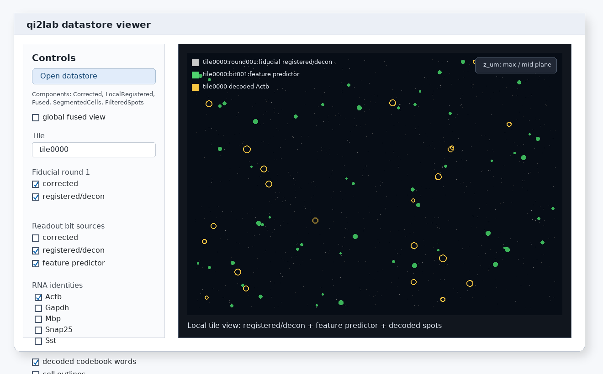
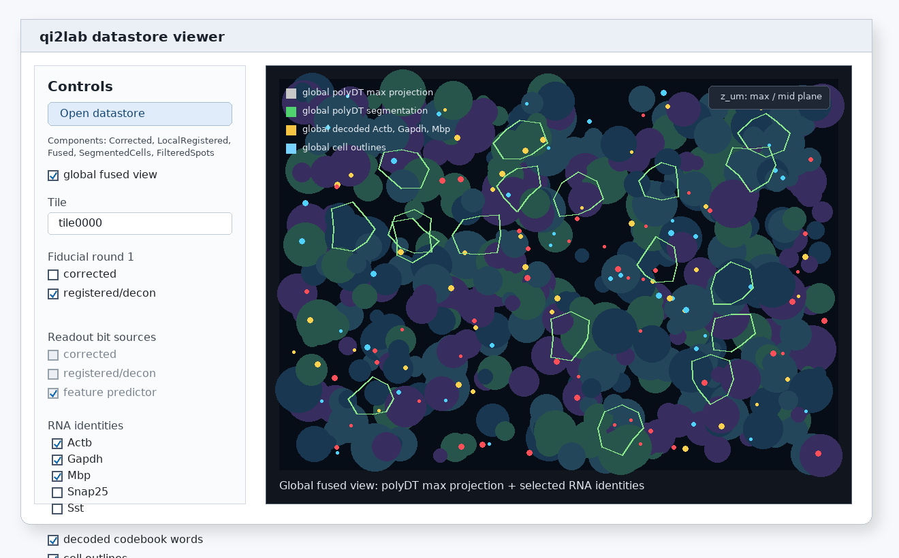

# NDV datastore viewer

`qi2lab-viewer` opens a read-only NDV/PyQt viewer for an existing
`qi2labdatastore`. It is intended for quick inspection of corrected data,
registered/deconvolved data, feature predictor images, decoded RNA overlays,
cell outlines, and fused global outputs.

The standard `uv sync` install includes the GUI dependencies needed by the
viewer.

## Launch

Open an experiment root:

```bash
qi2lab-viewer /path/to/experiment
```

or open a datastore directly:

```bash
qi2lab-viewer /path/to/experiment/qi2labdatastore
```

The viewer never writes to the datastore.

## Local tile view

Use local tile view to inspect one tile at a time. The controls let you choose:

- the tile ID
- corrected and registered/deconvolved fiducial images
- corrected, registered/deconvolved, and feature predictor readout images
- decoded codebook-word overlays
- cell-outline overlays when available
- RNA identities from the codebook; checking identities also selects the bits
  used by those codewords



## Global fused view

Enable **global fused view** when the datastore contains fused global polyDT
data and globally decoded outputs. In this mode the viewer displays the
downsampled polyDT max projection on the global coordinate canvas.

Global mode uses global XY coordinates for RNA overlays and intentionally ignores
the RNA z coordinate. This matches the downsampled max-projection polyDT image.
The RNA identity list filters which codebook identities are rasterized into the
overlay.

Optional global overlays are shown only when present in the datastore:

- global filtered decoded RNA features
- global cell outlines
- polyDT Cellpose segmentation



## Display checklist

If a control is disabled, the corresponding datastore component was not found.
Common prerequisites are:

- local corrected images for raw tile inspection
- local registered/deconvolved images for registered image inspection
- local feature predictor images for U-FISH probability display
- local or global decoded features for codebook-word overlays
- segmentation outputs for cell outlines
- fused global polyDT and global decoded features for global fused view

After changing selections, click **Display** to reload the NDV channel stack.
