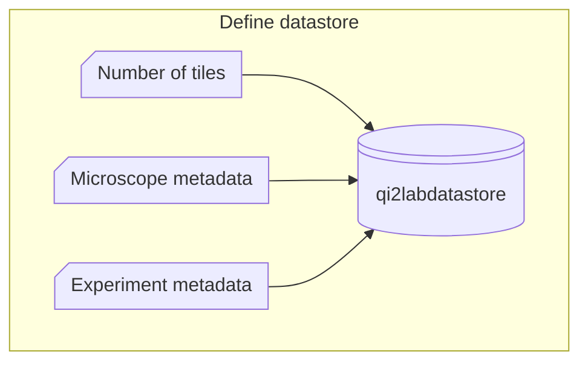
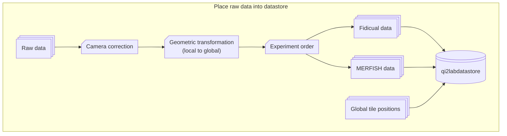
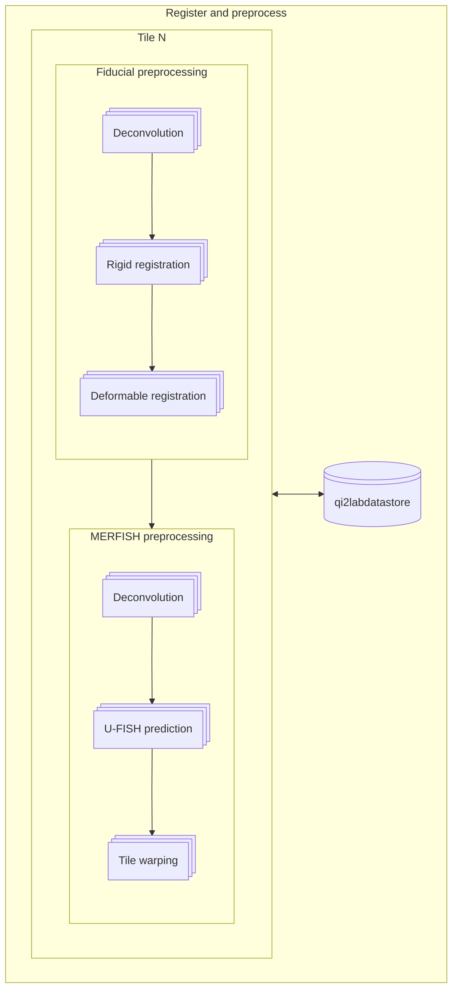

# Full Experiment Analysis Workflow

## Initialize datastore

## Populate datastore

##  Deconvolve, register, and spot predict all tiles

## Global registration and fusion of first fiducial round

## Cell segmentation of fused first fiducial round

## Pixel decoding

## 3D segmentation based on decoded RNA