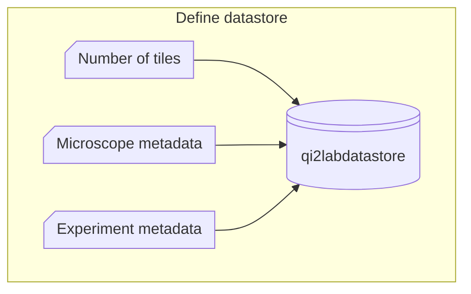
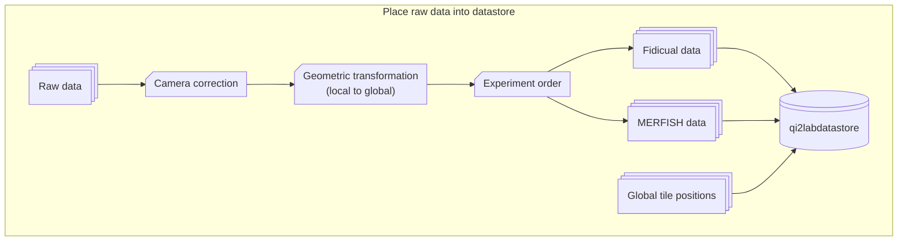
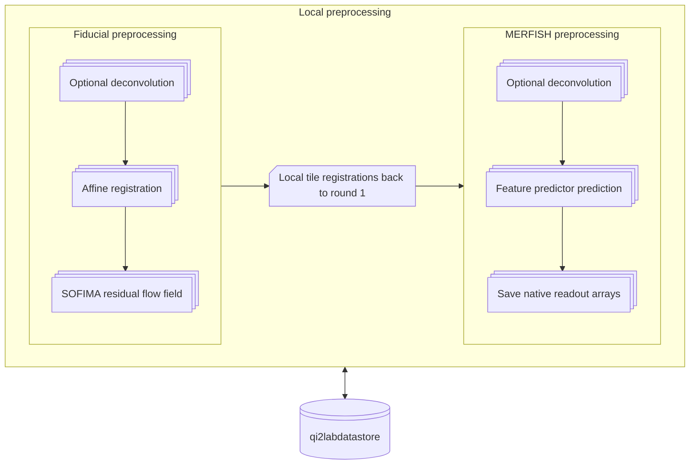
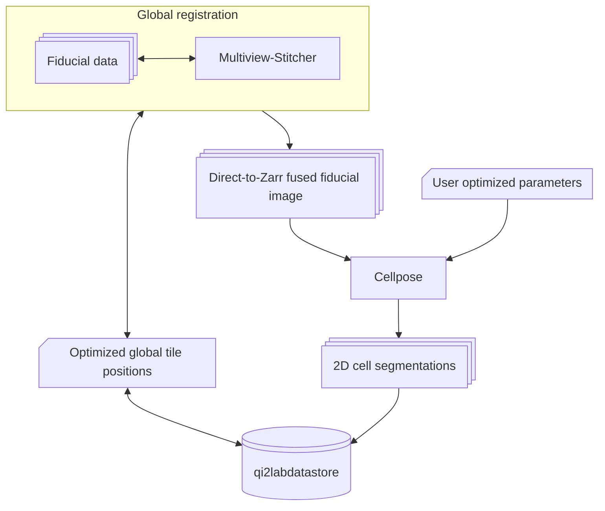
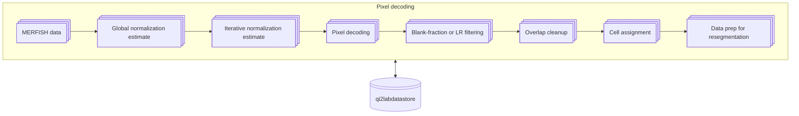
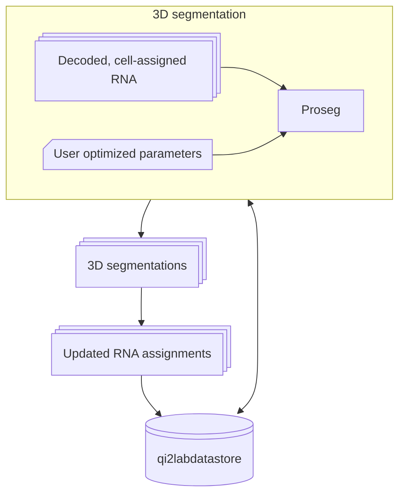

# Full Experiment Analysis Workflow

## Initialize datastore


```mermaid
%%{init: { "theme": "default", "themeVariables": { "htmlLabels": true, "curve": "linear", "layout": "elk" } } }%%
flowchart TD
 subgraph s1["Define datastore"]
        n1["Number of tiles"]
        n2["Microscope metadata"]
        n3["Experiment metadata"]
        n4["qi2labdatastore"]
  end
    n1 --> n4
    n2 --> n4
    n3 --> n4

    n1@{ shape: notch-rect}
    n2@{ shape: notch-rect}
    n3@{ shape: notch-rect}
    n4@{ shape: lin-cyl}
```

## Populate datastore


```mermaid
%%{init: { "theme": "default", "themeVariables": { "htmlLabels": true, "curve": "linear", "layout": "elk" } } }%%
flowchart TD
 subgraph s1["Place raw data into datastore"]
        n5["Raw data"]
        n12["Camera correction"]
        n6["Geometric transformation
        (local to global)"]
        n7["Experiment order"]
        n8["Fidicual data"]
        n9["MERFISH data"]
        n10["Global tile positions"]
        n11["qi2labdatastore"]
 end
    n5 --> n12
    n12 --> n6
    n6 --> n7
    n7 --> n8
    n7 --> n9
    n8 --> n11
    n9 --> n11
    n10 --> n11

    n5@{ shape: procs}
    n6@{ shape: notch-rect}
    n7@{ shape: notch-rect}
    n8@{ shape: procs}
    n9@{ shape: procs}
    n10@{ shape: procs}
    n11@{ shape: lin-cyl}
    n12@{ shape: notch-rect}
```
##  Deconvolve, locally register, and spot predict all tiles


```mermaid
%%{init: { "theme": "default", "themeVariables": { "htmlLabels": true, "curve": "linear", "layout": "elk" } } }%%
flowchart TD
 subgraph s2["MERFISH preprocessing"]
        n17["Optional deconvolution"]
        n18["Feature predictor prediction"]
        n19["Save native readout arrays"]
  end
 subgraph s3["Fiducial preprocessing"]
        n14["Optional deconvolution"]
        n15["Affine registration"]
        n16["SOFIMA residual flow field"]
  end
 subgraph s1["Local preprocessing"]
        s2
        s3
        n1["Local tile registrations back to round 1"]
  end
  n13["qi2labdatastore"]
   
    s3 --> n1
    n1 --> s2
    s1 <--> n13
    n14 --> n15
    n15 --> n16
    n17 --> n18
    n18 --> n19
    n1@{ shape: notch-rect}
    n13@{ shape: lin-cyl}
    n14@{ shape: procs}
    n15@{ shape: procs}
    n16@{ shape: procs}
    n17@{ shape: procs}
    n18@{ shape: procs}
    n19@{ shape: procs}
```

The qi2lab preprocessing CLI deconvolves both fiducial and readout images by
default. Pass `--no-decon` to disable readout deconvolution while retaining
fiducial deconvolution. Fiducial registration stores the affine transform for
each round relative to round 1. Local affine registration uses the qi2lab GPU
registration path:
lateral XY registration on a max-Z projection, followed by XYZ registration.
When deformable registration is enabled, preprocessing stores a SOFIMA residual
flow field in the moving fiducial round only when the field improves fiducial
alignment relative to affine alone. Readout preprocessing saves native
corrected data, optional deconvolved data, and feature-prediction images. Pixel
decoding loads those arrays and applies chromatic, affine, and SOFIMA transforms
in one sampling step.

Decoding operates on the tile's local round-1 grid. Local translation,
optional non-rigid refinement, and wavelength-dependent chromatic correction
align the bits on that grid. After decoding, transcript coordinates are mapped
to world coordinates using voxel spacing, recorded stage position,
camera/stage calibration, and the fitted global affine. Zhuang uses these same
methods; its acquisition-specific settings remain in the example.

## Global registration and fusion of first fiducial round


```mermaid
%%{init: { "theme": "default", "themeVariables": { "htmlLabels": true, "curve": "linear", "layout": "elk" } } }%%
flowchart TD
 subgraph s1["Global registration"]
    n3["Fiducial data"]
    n4["Multiview-Stitcher"]
 end
 n1["qi2labdatastore"]
 n2["Direct-to-Zarr fused fiducial image"]
 n5["Cellpose"]
 n6["2D cell segmentations"]
 n7["Optimized global tile positions"]
 n8["User optimized parameters"]
   
    s1 <--> n7
    n7 <--> n1
    s1 --> n2
    n3 <--> n4
    n2 --> n5
    n5 --> n6
    n6 --> n1
    n8 --> n5
    n1@{ shape: lin-cyl}
    n2@{ shape: procs}
    n3@{ shape: procs}
    n6@{ shape: procs}
    n7@{ shape: notch-rect}
    n8@{ shape: notch-rect}
```

Global registration follows the multiview-stitcher registration and fusion
workflow using the stage positions stored in the datastore as the starting
geometry. The registration step refines global tile transforms on CPU. The
fusion step writes directly to OME-Zarr with the CPU backend. Fiducial fusion
preserves Z spacing and downsamples each lateral axis by
`round(z_spacing / lateral_spacing, 1)` for the segmentation grid. Its
maximum-Z OME-TIFF uses the same downsampled grid. The fused spacing is saved
and used to transform Cellpose pixel ROIs into global coordinates; mask
metadata records the actual scale relative to the native tiles. The full global
stage can be rerun on an existing locally registered datastore with
`uv run qi2lab-preprocess /path/to/experiment --global-registration-only`.

## Fuse all channels

Once local and global registrations are complete, create one multichannel
OME-Zarr v0.5:

```bash
uv run qi2lab-fuseall /path/to/experiment \
  --output-chunk-zyx 32,2048,2048 \
  --fusion-workers 30 \
  --compression blosc-lz4 \
  --compression-level 1
```

The output is `qi2labdatastore/fused/full_dataset.ome.zarr`. Channel 0 is the
first-round fiducial; remaining channels are the codebook bits in numeric order.
MVS composes the stored chromatic correction, local-round affine, stage-camera
affine, stage position and global refinement while sampling native images.
SOFIMA fields are ignored. `--write-ome-tiffs` additionally exports one
full-resolution OME-TIFF per channel beside the OME-Zarr.

Both this command and `DataRegistration.py` use the same CPU fusion options.
The shared default codec is lossless Blosc-Zstd with bitshuffle at level 1.
`--compression blosc-lz4` selects lossless Blosc-LZ4 with bitshuffle for faster
encoding, with a data-dependent compression ratio. `--compression zstd` selects
plain Zstd. `--compression-level` accepts 1 through 9, with 1 favoring speed.
Compression is mandatory and applies to the full-resolution array and every
pyramid level. Codec changes do not alter fused pixels.

`--output-chunk-zyx` controls both computation and storage chunks. When omitted,
MVS uses the source chunk shape. Larger chunks reduce scheduling overhead but
increase each worker's interpolation and blending memory. `--fusion-workers`
sets the number of CPU worker processes. The example is intended for a machine
with substantial RAM; choose resources for the machine running the command.
Progress updates after each batch of four times the worker count, and pyramid
creation follows full-resolution fusion.

Rerunning the command replaces the existing `full_dataset.ome.zarr`; it does not
resume a partial fusion. Stop any existing fusion process before rerunning with
different compression settings. Registration metadata and source images are
reused, so preprocessing does not need to be repeated.

## Pixel decoding



```mermaid
%%{init: { "theme": "default", "themeVariables": { "htmlLabels": true, "curve": "linear", "layout": "elk" } } }%%
flowchart TD
 subgraph s1["Pixel decoding"]
    n2["MERFISH data"]
    n3["Global normalization estimate"]
    n4["Iterative normalization estimate"]
    n5["Pixel decoding"]
    n6["Blank-fraction or LR filtering"]
    n7["Overlap cleanup"]
    n8["Cell assignment"]
    n9["Data prep for resegmentation"]
 end
 n1["qi2labdatastore"]

    s1 <--> n1
    n2 --> n3
    n3 --> n4
    n4 --> n5
    n5 --> n6
    n6 --> n7
    n7 --> n8
    n8 --> n9

    n1@{ shape: lin-cyl}
    n2@{ shape: procs}
    n3@{ shape: procs}
    n4@{ shape: procs}
    n5@{ shape: procs}
    n6@{ shape: procs}
    n7@{ shape: procs}
    n8@{ shape: procs}
    n9@{ shape: procs}
```

Chromatic affine estimation is optional during iterative normalization. When
enabled, it estimates channel affines from decoded RNA centroids assigned to
valid nonblank codewords and writes the calibration back to the datastore for
subsequent decode-time warping.

## Viewer inspection

The read-only `viewer` command opens a Qt controller that can spawn NDV windows
for local and global datastore views. NDV displays Zarr-backed image channels.
Transcript points and cell boundaries from datastore decoding, Cellpose, Proseg,
or Baysor are rendered as sparse VisPy overlays. Local warped views use the same
stored chromatic, affine, and SOFIMA metadata as decoding, with independent
controls for each transform component.

## 3D segmentation based on decoded RNA


```mermaid
%%{init: { "theme": "default", "themeVariables": { "htmlLabels": true, "curve": "linear", "layout": "elk" } } }%%
flowchart TD
 subgraph s1["3D segmentation"]
    n3["Decoded, cell-assigned RNA"]
    n4["Proseg"]
    n6["User optimized parameters"]
 end
 n1["qi2labdatastore"]
 n2["3D segmentations"]
 n5["Updated RNA assignments"]

    s1 <--> n1
    n3 --> n4
    n6 --> n4
    s1 --> n2
    n2 --> n5
    n5 --> n1
    n1@{ shape: lin-cyl}
    n2@{ shape: procs}
    n3@{ shape: procs}
    n5@{ shape: procs}
    n6@{ shape: notch-rect}
```
